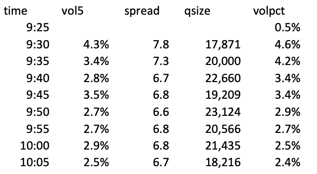
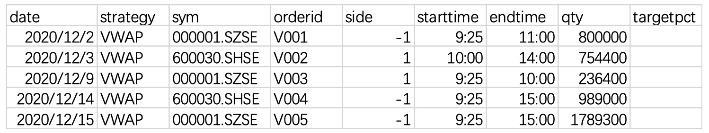
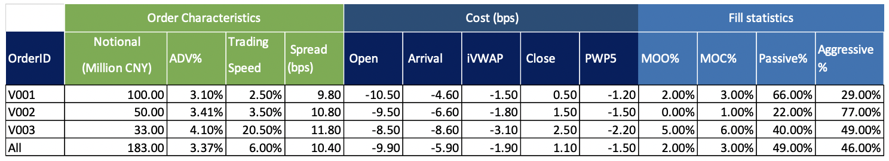

# CUHK FTEC5530 Assignment
- FTEC5530 Assignment I. Calculation of Stock Market Micro-structure
- FTEC5530 Assignment II. Trading Cost Analysis
- :star2: **Found this repository helpful?** Light it up with a star :star2: and make my day! :wink:
---

**Assignment I. Calculation of Stock Market Micro-structure**

Tick data sample(trade and quote) is provided in the month of 2020 Dec(trade.csv and quote.csv)

**1. Estimate the Average Daily Volume (ADV), Average Daily Turnover (ADTV) and daily volatility, intraday volatility (volatility5), average spread, avg quote size of each stock in the month of 2020 Dec.** **(****score: 40%** **)**

Result should be in a format like below:

| Stock       | ADV  | ADTV | Volatility | Volatility5 | Spread (bps) | Quote Size |
| ----------- | ---- | ---- | ---------- | ----------- | ------------ | ---------- |
| 000001.SZSE |      |      |            |             |              |            |
| 600030.SHSE |      |      |            |             |              |            |

**2. Generate the intraday market micro-structure report for stock 600030, draw the every 5- min intraday chart for volume profile, volatility/spread/quote size profile (score: 60% )**

Format sample:

Hint: generate minutely and daily data from the raw and quote data, and perform calculation.

**Requirement**:
 Provide both of your code script (python/R/MATLAB/KDB or other languages) and result.

---

**Assignment II. Trading Cost Analysis**

**Tick data** (trade and quote) is provided in the month of 2020 Dec (trade.csv and quote.csv)

**VWAP orders** as below: (parent_oder.csv)

**Child order execution** data is provided (child_order.csv)

**Aim:**

Calculate the trading cost analysis as below format (assignment 2.xlsx).

Please note there are only three orders in above example for illustration purpose, the assignment has five orders.

**Hint:**

- the performance number should be all side adjusted

- If order start time is before market open, then arrival price should use open price

  instead of mid of quote

- Sometime market tick data has small delay, for example, you may see last price end

  around 15:00:03, you should normalize all trades after 14:57 as close price, timestamp as 15:00: for example an order end time is 15:00, then all those trades slightly after 15:00:00 shall be also included for iVWAP or volume calculation

  . **Requirement**:

  Provide both of your code script (python/R/MATLAB/KDB or other languages, KDB is a plus) and result (filled in the assignment 2.xlsx spreadsheet with 2 digital accuracy).

---
- :star2: **Found this repository helpful?** Light it up with a star :star2: and make my day! :wink:
